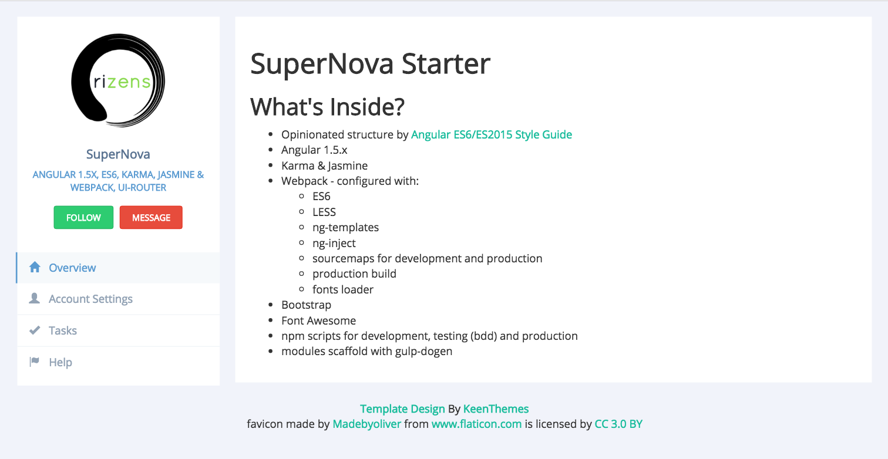

# SuperNova Starter

  
An opinionated boilerplate by [Angular ES6/ES2015 Style Guide](https://github.com/orizens/angular-es6-styleguide) by [orizens](http://orizens.com): 

  
## What's Inside 
- Angular 1.5.x
- ui-router 1.x (component support)
- Karma & Jasmine
- Webpack - configured with:
  - ES6
  - LESS
  - ng-templates
  - ng-inject
  - sourcemaps for development and production
  - production build
  - fonts loader
- bootstrap
- font-awesome
- npm scripts for development, testing (bdd) and production
- modules scaffold with gulp-dogen
- FULLSTACK: json-server for mocking backend api during development - available in [fullstack branch](https://github.com/orizens/echoes/tree/fullstack)

## Quick Start
- nodejs >= 5, npm > 3
- clone this repo

```shell
# clone repo
# --depth 1 removes all but one .git commit history
git clone --depth 1 https://github.com/orizens/supernova-angular-1.5.x-es6-starter.git

# change directory to our repo
cd supernova-angular-1.5.x-es6-starter

# install dependencies with npm
npm install

# start dev server
npm start
```
navigate to http://localhost:9001 in your browser for the front end  
navigate to http://localhost:3000 in your browser to view the available routes in the local server api which is served from **[tests/mocks/db.json](tests/mocks/db.json)**.  
For more info: [json-server documentation](https://github.com/typicode/json-server) 

## File Structure
```
supernova-angular-1.5.x-es6-starter/
 ├──config/                        * our configuration
 |   ├──config/                    * saved for e2e and remote e2e testing
 |   ├──dist-assets/               * static files for production - these are copied to dist after with prod task
 |   ├──templates/                 * gulp-dogen modules templates for scaffolding modules
 |   ├──deploy.sh                  * script used to deploy dist to github:gh-pages branch with TravisCI
 │   ├──dogen.js                   * gulp task to configure templates for scaffolding
 │   ├──e2e-test.js                * saved for configuring e2e test runner
 │   └──server.js                  * gulp helper task to run server for dist
 │     
 ├──src/                           * source files of the whole app
 |   ├──app.js                     * entry file for the app
 │   │     
 |   ├──index.html                 * main index page (app.js and vendors.js are added automatically )
 │   │     
 │   ├──components/                * all SMART components should be created here
 │   │   ├──home/                  * an example for a smart component: includes less
 │   │     
 │   └──core/                      * core layer of the app
 │   │   ├──components/            * all dumb components should be created here
 │   │   ├──services/              * all services of the app should be created here so SMART components can import it
 │   │   ├──css/                   * app wide less styles
 │   │   ├──config/                * config phase for each environment
 │   │     
 ├──tests/                         * currently saved for mock files and e2e tests
 │     
 ├──.eslintrc.json                 * eslint config
 ├──package.json                   * what npm uses to manage it's dependencies
 └──specs.bundle.js                * used by karma to collect spec files to run tests
 └──webpack.config.js              * webpack configuration file for development
 └──webpack.config.production.js   * webpack configuration file for production

```

## Modules Scaffolding
this package uses **gulp-dogen** for scaffolding.
There are 2 templates in **config/templates**:
1. ngmodule
2. ngservice

to scaffold, run in terminal:
```shell
# to scaffold new ng component in src/components
npm run dogen -- --ngmodule the-name-of-module
# to scaffold new ng service in src/core/services
npm run dogen -- --ngservice the-name-of-service
```

## Adding 3rd party / vendors
the build creates 2 bundled files:
1. app.bundle.js - includes the files created by you
2. vendors.bundle.js - includes the files created by the list configured in **webpack.config.js**. Simply add the npm package name to the list of vendors.

## Testing with BDD
to run tests while developing use:
```npm run bdd```
to run tests once use:
```npm test```
running unit tests in debug mode - ```npm run testd```

## Creating A Production Build
A production build is configured by webpack.config.production.js.
to create a build, simply run:
```npm run prod```
This creates a **dist** directory with a minified and bundled version of the app.

You can run a local server to check the dist build by ```npm run prod:serve```. It is based on lite-server and can be extended through **config/prod-config.json** by the [various options available to it](https://github.com/johnpapa/lite-server).

## Plans To Add
- testing for all files - Currently testing only core directory
- protractor / e2e
- browserstack configuration / remote e2e
- ngMaterial
- component router
- rxjs
- ngRedux

## Contributing
To request a feature - please open an issue.
Better than this, open a PR with your proposed update.

Thanks.  
